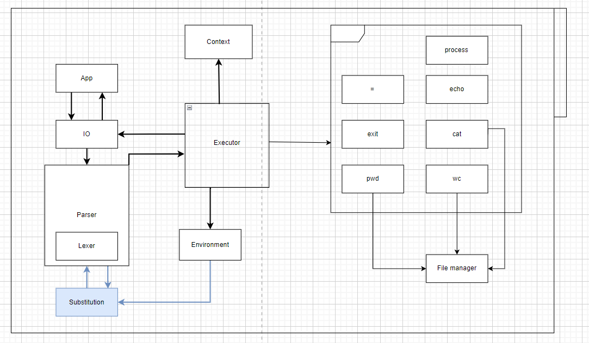

# Software Design



* **App** – Точка входа в приложение. Использует другие модули для обработки запросов.

* **I/O** – Компонента, отвечающая за связь с внешним миром (в нашем случае с консолью. Пишет и читает из нее).

* **Parser** – Парсит строку и возвращает очередь команд для выполнения.<br>
  *Описание:* <br>
  Получаем на вход строку. Передаем ее в Substitution, получаем от него новую строчку. Передаем ее лексеру, который разобьет ее на токены.<br><br>
  Token List:
  - SYMBOLS `[^ \s | = ' "]+`
  - PIPE`|`
  - EQ`=`
  - SINGLE_QUOTES`'[^']*'`
  - DOUBLE_QUOTES`"[^"]*"`<br><br>
  
  Далее полученные токены передаем парсеру, и строим AST дерево по следующей грамматике:

  ```
  arg:   | SYMBOLS
         | SINGLE_QUOTES
         | DOUBLE_QUOTES

  args:  | arg
         | args arg

  expr:  | SYMBOLS             (1)
         | SYMBOLS args        (2)
         | SYMBOLS EQ SYMBOLS
         | SYMBOLS EQ SINGLE_QUOTES
         | SYMBOLS EQ DOUBLE_QUOTES
         | expr PIPE expr
  ```
  Где `args` - аргументы, передаваемые в команды, а `expr` - выражение, которое хотим распарсить. <br><br>   Пробелы игнорируются (`x=10` эквивалетно `x = 10`)<br><br>
  При построении AST определяем, являются ли `SYMBOLS` в п. (1) и (2) зарезирвированной командой - иначе внешняя программа, убираем внешние кавычки у `SINGLE_QUOTES` и `DOUBLE_QUOTES` аргументов<br><br> 

  После этого проходимся по построенному AST слева направо и создаем очередь из команд, передавая в конструктор их аргументы<br><br>

  Если на каком либо из этапов произошла ошибка (например, при токенизации строки), необходимо бросить исключение с описанием ошибки.


* **Substitution** – Модуль, отвечающий за подстановку переменных в строку <br>
 *Описание:* <br> Выполняем подстановку: для этого пройдемся по строчке запоминая, в каких самых внешних кавычках мы находимся (если находимся вообще).
  Ищем конструкции  `$varName`.<br> 
  Если внешняя кавычка одинарная, то идем до следующей одинарной без подстановок, если двойная, то идем до следующей двойной и делаем подстановки (даже если `$varName` находится внутри одинарных кавычек). Если необходима подстановка переменной, которая отсутствует в окружении, подставляем пустую строку. Возвращаем измененную строку.

* **Environment** – Хранилище переменных из окружения. <br>
  *Описание:* <br>
  Хранит словарь со всеми переменными окружения.


* **Executor** – Элемент программы, который отвечает за запуск команд из очереди <br>
  *Описание:* <br>
  Принимает на вход очередь команд. Создает и поддерживает в корректном состоянии класс Context, в котором будут лежать:
  - Результат выполнения предыдущей команды
  - `Environment`, отвечающий за переменные окружения. <br><br>
  
  Последовательно выполняет команды, вызывая метод `execute(Context)`. После выполнения очередной команды присваивает ее результат в `Context`. <br><br>
  
  Если при выполнении команды произошла ошибка (код возврата команды не равен нулю), то возвращаем результат этой команды, прерывая последовательное выполнение.

* **FileManager** – Компонента, отвечающая за работу с файловой системой. Необходима для выполнения базовых операций с файлами.<br>
  *Описание:* <br>
  Список методов:
  - is_file - проверяет, существует ли файл
  - get_file_content - возвращает содержимое файла
  - get_directory_content - возвращает названия файлов в директории
  - get_current_directory - возвращает путь до текущей рабочей директории
  

* **Описание команд:**<br>
   Каждая команда - это класс с методом `execute`, который получает на вход текущий `Context` и возвращает результат выполнения: результирующую строку и код возврата.
  - cat — вывести на экран содержимое файла/файлов;<br>
*Описание:* Проверяем, что все переданные аргументы являются путями до существующих файлов, используя **FileManager**. Обьединенияем их содержимое и возврщаем его с нулевым кодом возврата. Если хотя бы один из аргументов не является файлом, то возвращаем сообщение об ошибке и ненулевой код возврата. В случае отсутствия аргументов берем результат выполения предыдущей команды как аргумент. Если и результат преыдущей команды отсутствует, то возвращаем ошибку и ненулевой код возврата. 
   

  
  - echo — вывести на экран свой аргумент (или аргументы);<br>
  *Описание:*<br>
    Игнорирует результат предыдущей команды. Если аргументов нет, возвращает пустую строку с нулевым кодом возврата, иначе возвращает все аргументы также с нулевым кодом возврата.<br><br>

  - wc — вывести количество строк, слов и байт в файле/файлах;<br>
  *Описание:*<br> 
  Проверяем, что все переданные аргументы являются путями до существующих файлов, используя **FileManager**. Для каждого файла считаем кол-во строк, слов и байт, последовательно обьединяя результаты. Возвращаем общий результат с нулевым кодом возврата. Если аргументов не передано, то считаем кол-во строк, слов и байт для результата предыдущей команды. Если и преыдущего результата нет, то возвращаем сообщение об ошибке с ненулевым кодом возврата. <br><br>

  - pwd — вывести текущую директорию;<br>
  *Описание:*<br>  Выводит пользователю текущую директорию используя **FileManager**<br><br>

  - exit — выйти из интерпретатора. <br>
    *Описание:*<br> В глобальном флаге ``is_shell_terminated`` ставим `True`. Таким образом, обратываемый ввод станет последним, который выполнит интерпритатор. Возвращаем пустую строку и нулевой код возврата. <br><br>
    
  - eq — обновляет/добавляет значение переменной в **Environment**<br><br>

  - process — запускает внешнюю программу через ``subprocess``, передавая туда переменные окружения **Environment**